## 1. Flowcharts

A flowchart is a type of diagram that represents an algorithm, workflow or process. The flowchart shows the steps as boxes of various kinds, and their order by connecting the boxes with arrows. This diagrammatic representation illustrates a solution model to a given problem.

### 1.1 Graph

Possible directions are:

-   `TB` - top bottom
-   `BT` - bottom top
-   `RL` - right left
-   `LR` - left right
-   `TD` - same as TB

##### Top to bottom

```raw
graph TB;  
    A-->B;
```

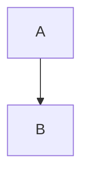

##### Bottom to top

```raw
graph BT;  
    A-->B;
```

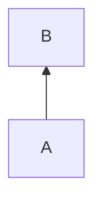

##### Right to left

```
graph RL;  
    A-->B;
```

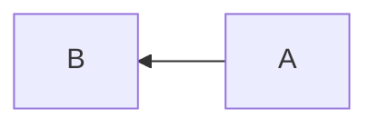

##### Left to Right

```
graph LR;  
    A-->B;
```


##### Top down

```
graph TD;  
    A-->B;
```


### 1.2 Nodes & shapes

##### Node with Text

```raw
graph LR;  
    id1[This is the text in the box]
```

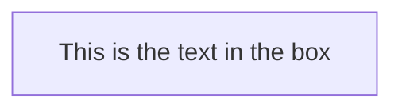

##### Node with Round Edges

```raw
graph LR;  
    id1(This is the text in the box)
```

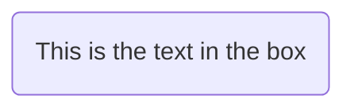

##### Node in Circle Form

```
graph LR;  
    id1((This is the text in the circle))
```

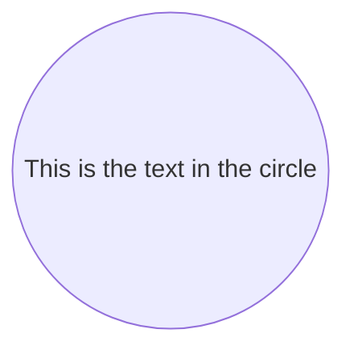

##### Node in Asymmetric Shape

```
graph LR;  
    id1>This is the text in the box]
```

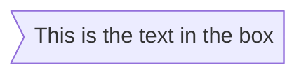

##### Node in Rhombus Form

```raw
graph LR;  
    id1{This is the text in the box}
```

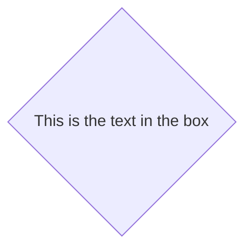

### 1.3 Links Between Nodes

##### Link with Arrow Head

```
graph LR;  
    A-->B
```


##### Open Link

```
graph LR;  
    A---B
```

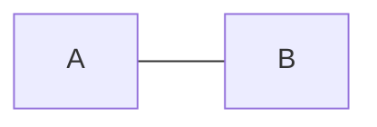

##### Text on Links(1)

```
graph LR;  
    A-- This is the text ---B
```

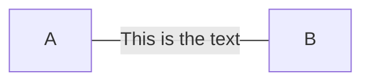

##### Text on Links(2)

```
graph LR;  
    A---|This is the text|B
```


##### Link with Arrow Head and Text(1)

```
graph LR;  
    A-->|text|B
```

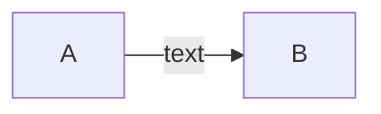

##### Link with Arrow Head and Text(2)

```
graph LR;  
    A-- text -->B
```


##### Dotted Link

```
graph LR;  
    A-.->B;
```

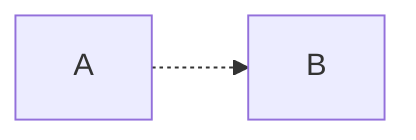

##### Dotted Link with Text

```
graph LR;  
    A-. text .-> B
```
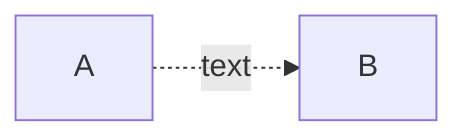

##### Thick Link

```
graph LR;  
    A ==> B
```

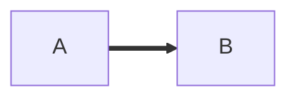

##### Thick link with text

```
graph LR;  
    A == text ==> B
```

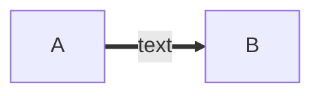

### 1.4 Subgraphs

#### Syntax

```raw
subgraph title
    graph definition
end
```

#### Example

```raw
graph TB
    c1-->a2
    subgraph one
    a1-->a2
    end
    subgraph two
    b1-->b2
    end
    subgraph three
    c1-->c2
    end
```

```mermaid
graph TB
    c1-->a2
    subgraph one
    a1-->a2
    end
    subgraph two
    b1-->b2
    end
    subgraph three
    c1-->c2
    end
```


## 2. Sequence Diagrams

A Sequence diagram is an interaction diagram that shows how processes operate with one another and in what order.

### 2.1 Participants

The participants or actors are rendered in order of appearance in the diagram source text.

```mermaid
sequenceDiagram
    participant Alice
    participant John
    Alice->>John: Hello John, how are you?
    John-->>Alice: Great!
```

You can specify the actor’s order of appearance to show the participants in a different order.

```raw
sequenceDiagram
    participant John
    participant Alice
    Alice->>John: Hello John, how are you?
    John-->>Alice: Great!
```

```mermaid
sequenceDiagram
    participant John
    participant Alice
    Alice->>John: Hello John, how are you?
    John-->>Alice: Great!
```

The participants can be defined implicitly without specifying them with the `participant` keyword.

```raw
sequenceDiagram
    Alice->>John: Hello John, how are you?
    John-->>Alice: Great!
```

```mermaid
sequenceDiagram
    Alice->>John: Hello John, how are you?
    John-->>Alice: Great!
```

### 2.2 Aliases

The participant can have a convenient identifier and a descriptive label.

```raw
sequenceDiagram
    participant A as Alice
    participant J as John
    A->>J: Hello John, how are you?
    J-->>A: Great!
```

```mermaid
sequenceDiagram
    participant A as Alice
    participant J as John
    A->>J: Hello John, how are you?
    J-->>A: Great!
```

### 2.3 Messages

Messages can be of two displayed either solid or with a dotted line.

#### Schema

```raw
[Actor][Arrow][Actor]:Message text
```

There are six types of arrows currently supported:

| Arrow Type | Description                                 |
| ---------- | ------------------------------------------- |
| ->         | Solid line without arrow                    |
| –>         | Dotted line without arrow                   |
| -»         | Solid line with arrowhead                   |
| –»         | Dotted line with arrowhead                  |
| -x         | Solid line with a cross at the end (async)  |
| –x         | Dotted line with a cross at the end (async) |


### 2.4 Activations

#### Examples

##### Activate and deactivate an actor.

```raw
sequenceDiagram

    Alice->>John: Hello John, how are you?

    activate John

    John-->>Alice: Great!

    deactivate John
```

```mermaid
sequenceDiagram

    Alice->>John: Hello John, how are you?

    activate John

    John-->>Alice: Great!

    deactivate John
```

##### Activate via symbols

```raw
sequenceDiagram

    Alice->>+John: Hello John, how are you?

    John-->>-Alice: Great!
```

```mermaid
sequenceDiagram

    Alice->>+John: Hello John, how are you?

    John-->>-Alice: Great!
```

##### Multiple activiations

```raw
sequenceDiagram

    Alice->>+John: Hello John, how are you?

    Alice->>+John: John, can you hear me?

    John-->>-Alice: Hi Alice, I can hear you!

    John-->>-Alice: I feel great!
```

```mermaid
sequenceDiagram

    Alice->>+John: Hello John, how are you?

    Alice->>+John: John, can you hear me?

    John-->>-Alice: Hi Alice, I can hear you!

    John-->>-Alice: I feel great!
```

### 2.5 Notes

Add notes to a sequence diagram by the notation `Note`.

#### Schema

`Note [ right of | left of | over ] [Actor]: Text in note content`

#### Examples

##### Right Side

```raw
sequenceDiagram

    participant John

    Note right of John: Text in note
```

```mermaid
sequenceDiagram

    participant John

    Note right of John: Text in note
```

##### Left Side

```raw
sequenceDiagram

    participant John

    Note left of John: Text in note
```

```mermaid
sequenceDiagram

    participant John

    Note left of John: Text in note
```

##### Over

```raw
sequenceDiagram

    participant John

    Note over John: Text in note
```

```mermaid
sequenceDiagram

    participant John

    Note over John: Text in note
```

##### Create notes spanning two participants

```raw
sequenceDiagram

    Alice->>John: Hello John, how are you?

    Note over Alice,John: A typical interaction
```

```mermaid
sequenceDiagram

    Alice->>John: Hello John, how are you?

    Note over Alice,John: A typical interaction
```

### 2.6 Loops

Express loops in a sequence diagram by the notation `loop`.

#### Schema

```raw
loop Loop text
    ... statements ...
end
```

#### Example

```raw
sequenceDiagram

    Alice->John: Hello John, how are you?

    loop Every minute

        John-->Alice: Great!

    end
```

```mermaid
sequenceDiagram

    Alice->John: Hello John, how are you?

    loop Every minute

        John-->Alice: Great!

    end
```


### 2.7 Alt

#### Schema

Express alternative paths in a sequence diagram by the notation `alt`.

```raw
alt Describing text
    ... statements ...
else
    ... statements ...
end
```

Or, if there is sequence that is optional (if without else).

```raw
opt Describing text
     ... statements ...
end
```

### Example:

```raw
sequenceDiagram

    Alice->>John: Hello John, how are you?

    alt is sick

        John->>Alice: Not so good :(

    else is well

        John->>Alice: Feeling fresh like a daisy
    end
    opt Extra response
        John->>Alice: Thanks for asking
    end
```

```mermaid
sequenceDiagram

    Alice->>John: Hello John, how are you?

    alt is sick

        John->>Alice: Not so good :(

    else is well

        John->>Alice: Feeling fresh like a daisy
    end
    opt Extra response
        John->>Alice: Thanks for asking
    end
```

## 3. Gant Diagrams

A Gantt chart is a type of bar chart, first developed by Karol Adamiecki in 1896, and independently by Henry Gantt in the 1910s, that illustrates a project schedule. Gantt charts illustrate the start and finish dates of the terminal elements and summary elements of a project.

```raw
gantt
       dateFormat  YYYY-MM-DD
       title Adding GANTT diagram functionality to mermaid

       section A section
       Completed task            :done,    des1, 2018-01-06,2018-01-08
       Active task               :active,  des2, 2018-01-09, 3d
       Future task               :         des3, after des2, 5d
       Future task2              :         des4, after des3, 5d

       section Critical tasks
       Completed task in the critical line :crit, done, 2018-01-06,24h
       Implement parser and jison          :crit, done, after des1, 2d
       Create tests for parser             :crit, active, 3d
       Future task in critical line        :crit, 5d
       Create tests for renderer           :2d
       Add to mermaid                      :1d

       section Documentation
       Describe gantt syntax               :active, a1, after des1, 3d
       Add gantt diagram to demo page      :after a1  , 20h
       Add another diagram to demo page    :doc1, after a1  , 48h

       section Last section
       Describe gantt syntax               :after doc1, 3d
       Add gantt diagram to demo page      :20h
       Add another diagram to demo page    :48h
```

```mermaid
gantt
       dateFormat  YYYY-MM-DD
       title Adding GANTT diagram functionality to mermaid

       section A section
       Completed task            :done,    des1, 2018-01-06,2018-01-08
       Active task               :active,  des2, 2018-01-09, 3d
       Future task               :         des3, after des2, 5d
       Future task2              :         des4, after des3, 5d

       section Critical tasks
       Completed task in the critical line :crit, done, 2018-01-06,24h
       Implement parser and jison          :crit, done, after des1, 2d
       Create tests for parser             :crit, active, 3d
       Future task in critical line        :crit, 5d
       Create tests for renderer           :2d
       Add to mermaid                      :1d

       section Documentation
       Describe gantt syntax               :active, a1, after des1, 3d
       Add gantt diagram to demo page      :after a1  , 20h
       Add another diagram to demo page    :doc1, after a1  , 48h

       section Last section
       Describe gantt syntax               :after doc1, 3d
       Add gantt diagram to demo page      :20h
       Add another diagram to demo page    :48h
```

## 4. Demos

### 4.1 Basic Flowchart

```raw
graph LR
    A[Square Rect] -- Link text --> B((Circle))
    A --> C(Round Rect)
    B --> D{Rhombus}
    C --> D
```

```mermaid
graph LR
    A[Square Rect] -- Link text --> B((Circle))
    A --> C(Round Rect)
    B --> D{Rhombus}
    C --> D
```

### 4.2 Flowchart with Decision

```raw
graph TD
    A[Christmas] -->|Get money| B(Go shopping)
    B --> C{Let me think}
    C -->|One| D[Laptop]
    C -->|Two| E[iPhone]
    C -->|Three| F[fa:fa-car Car]
```

```mermaid
graph TD
    A[Christmas] -->|Get money| B(Go shopping)
    B --> C{Let me think}
    C -->|One| D[Laptop]
    C -->|Two| E[iPhone]
    C -->|Three| F[fa:fa-car Car]
```

### 4.3 Larger Flowchart with Some Styling

```raw
graph TB
    sq[Square shape] --> ci((Circle shape))

    subgraph A
        od>Odd shape]-- Two line<br/>edge comment --> ro
        di{Diamond with <br/> line break} -.-> ro(Rounded<br>square<br>shape)
        di==>ro2(Rounded square shape)
    end

    %% Notice that no text in shape are added here instead that is appended further down
    e --> od3>Really long text with linebreak<br>in an Odd shape]

    %% Comments after double percent signs
    e((Inner / circle<br>and some odd <br>special characters)) --> f(,.?!+-*ز)

    cyr[Cyrillic]-->cyr2((Circle shape Начало));

     classDef green fill:#9f6,stroke:#333,stroke-width:2px
     classDef orange fill:#f96,stroke:#333,stroke-width:4px
     class sq,e green
     class di orange
```

```mermaid
graph TB
    sq[Square shape] --> ci((Circle shape))

    subgraph A
        od>Odd shape]-- Two line<br/>edge comment --> ro
        di{Diamond with <br/> line break} -.-> ro(Rounded<br>square<br>shape)
        di==>ro2(Rounded square shape)
    end

    %% Notice that no text in shape are added here instead that is appended further down
    e --> od3>Really long text with linebreak<br>in an Odd shape]

    %% Comments after double percent signs
    e((Inner / circle<br>and some odd <br>special characters)) --> f(,.?!+-*ز)

    cyr[Cyrillic]-->cyr2((Circle shape Начало));

     classDef green fill:#9f6,stroke:#333,stroke-width:2px
     classDef orange fill:#f96,stroke:#333,stroke-width:4px
     class sq,e green
     class di orange
```

### 4.4 Basic Sequence Diagram
```raw
sequenceDiagram
    Alice ->> Bob: Hello Bob, how are you?
    Bob-->>John: How about you John?
    Bob--x Alice: I am good thanks!
    Bob-x John: I am good thanks!
    Note right of John: Bob thinks a long<br/>long time, so long<br/>that the text does<br/>not fit on a row.

    Bob-->Alice: Checking with John...
    Alice->John: Yes... John, how are you?
```

```mermaid
sequenceDiagram
    Alice ->> Bob: Hello Bob, how are you?
    Bob-->>John: How about you John?
    Bob--x Alice: I am good thanks!
    Bob-x John: I am good thanks!
    Note right of John: Bob thinks a long<br/>long time, so long<br/>that the text does<br/>not fit on a row.

    Bob-->Alice: Checking with John...
    Alice->John: Yes... John, how are you?
```

### 4.5 Message to Self in Loop

```raw
sequenceDiagram
    participant Alice
    participant Bob
    Alice->>John: Hello John, how are you?
    loop Healthcheck
        John->>John: Fight against hypochondria
    end
    Note right of John: Rational thoughts<br/>prevail...
    John-->>Alice: Great!
    John->>Bob: How about you?
    Bob-->>John: Jolly good!
```

```mermaid
sequenceDiagram
    participant Alice
    participant Bob
    Alice->>John: Hello John, how are you?
    loop Healthcheck
        John->>John: Fight against hypochondria
    end
    Note right of John: Rational thoughts<br/>prevail...
    John-->>Alice: Great!
    John->>Bob: How about you?
    Bob-->>John: Jolly good!
```
