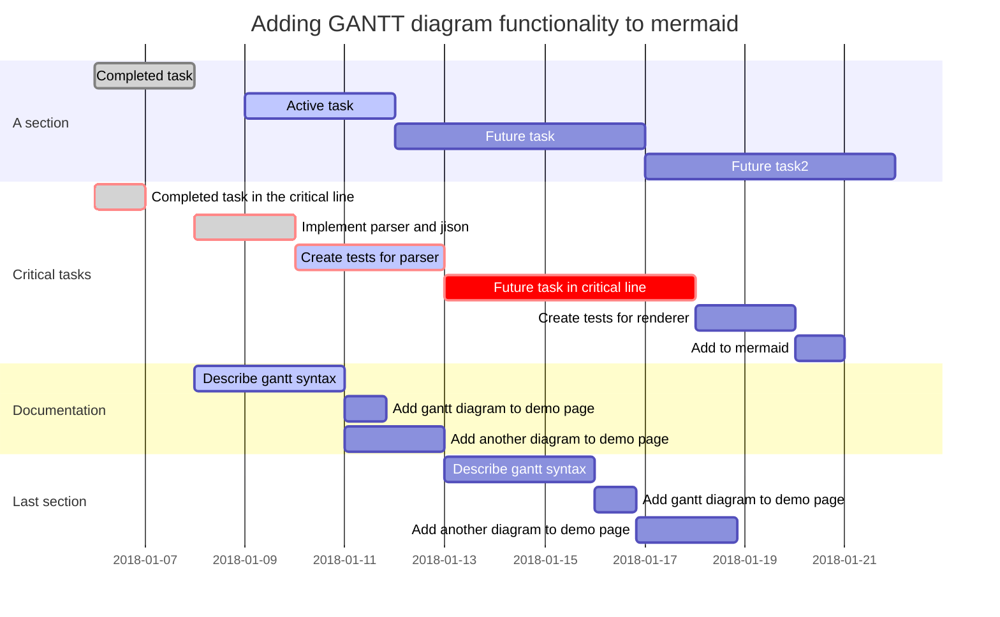

This is just a test of if mermaid works via a conditional include.

## How its done

First this page has this YAML frontmatter:

```yaml
---
title: Mermaid Testing!
mermaid: true
---
```

Then in 

FILE: 'project/_includes/mermaid.html'

```html
<script type="text/javascript">
  let mermaidNodes = document.querySelectorAll('code.language-mermaid');
  for (let mermaidNode of mermaidNodes) {
    mermaidNode.classList = ['mermaid'];
  }
</script>
<script type="module">
  import mermaid from "https://cdn.jsdelivr.net/npm/mermaid@10/dist/mermaid.esm.min.mjs";
</script>
```

And in your layout for your notes:

```html
<html>
  <head>
  </head>
  <body>
  ...
  ...
    
      
    
  </body>
</html>
```

lets see if it works ;)


